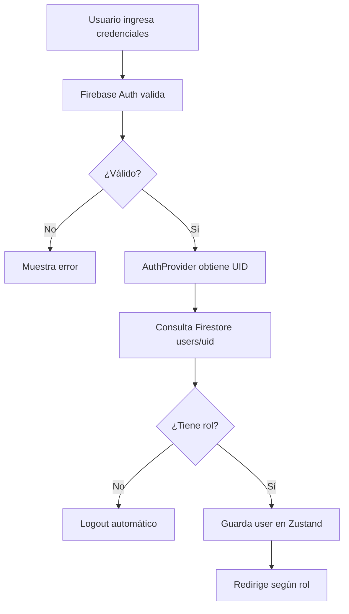

# 🔐 Sistema de Autenticación con Firebase Auth

## Resumen de Implementación

Este documento explica el sistema de autenticación y control de roles implementado con Firebase Authentication.

## 📋 Arquitectura

### 1. **Firebase Authentication**
- Maneja la autenticación de usuarios
- Almacena credenciales de forma segura
- Proporciona tokens JWT para sesiones

### 2. **Firestore - Colección `users`**
```typescript
{
  uid: string,           // ID del usuario en Firebase Auth
  email: string,         // Email del usuario
  role: "mesero" | "cocina" | "admin",  // Rol asignado
  displayName: string,   // Nombre para mostrar
  createdAt: string      // Fecha de creación
}
```

### 3. **Sistema de Permisos**

Los permisos se definen en `/store/useUserStore.ts`:

```typescript
export const rolePermissions: Record<UserRole, string[]> = {
  mesero: ["mesero", "bebidas"],
  cocina: ["cocina"],
  admin: ["mesero", "bebidas", "cocina", "admin", "caja"],
};
```

**Roles y permisos:**
- **mesero**: Acceso a vista de mesero y panel de bebidas
- **cocina**: Solo acceso a la cocina
- **admin**: **ACCESO TOTAL** - puede entrar a todas las vistas (mesero, cocina, admin, caja)

## 🚀 Configuración Inicial

### 1. Instalar dependencias

```bash
bun add -d firebase-admin
```

### 2. Configurar variables de entorno

Copia `.env.example` a `.env.local` y completa con tus credenciales:

```bash
cp .env.example .env.local
```

**Obtener credenciales de Firebase Admin SDK:**
1. Ve a Firebase Console → Tu Proyecto
2. Settings (⚙️) → Project Settings
3. Service Accounts → Generate New Private Key
4. Copia el contenido del archivo JSON:
   - `client_email` → `FIREBASE_CLIENT_EMAIL`
   - `private_key` → `FIREBASE_PRIVATE_KEY`

### 3. Crear usuarios iniciales

```bash
bun run seed:users
```

Este script creará 3 usuarios:
- `admin@local.com` - **Acceso completo a todo el sistema**
- `mesero@local.com` - Acceso a mesero y bebidas
- `cocina@local.com` - Solo acceso a cocina

**Contraseña para todos:** `1234`

## 🔒 Componentes de Seguridad

### AuthProvider (`/contexts/AuthContext.tsx`)

Proveedor de contexto que:
- Escucha cambios en Firebase Auth
- Obtiene el rol del usuario desde Firestore
- Sincroniza el estado con Zustand
- Maneja el logout

### ProtectedRoute (`/components/ProtectedRoute.tsx`)

Componente HOC para proteger rutas:

```tsx
// Por permiso específico
<ProtectedRoute requiredPermission="cocina">
  <CocinaPage />
</ProtectedRoute>

// Por roles permitidos
<ProtectedRoute allowedRoles={["admin"]}>
  <AdminPage />
</ProtectedRoute>
```

## 🛣️ Rutas Protegidas

| Ruta | Protección | Acceso |
|------|-----------|--------|
| `/dashboard/mesero` | `requiredPermission="mesero"` | Admin, Mesero |
| `/dashboard/cocina` | `requiredPermission="cocina"` | Admin, Cocina |
| `/dashboard/admin` | `allowedRoles={["admin"]}` | Solo Admin |
| `/dashboard/mesero/bebidas` | `requiredPermission="bebidas"` | Admin, Mesero |

## 📱 Flujo de Autenticación



## 🔐 Verificación de Permisos

### En el código:

```tsx
const { user, hasPermission } = useUserStore();

// Verificar permiso
if (hasPermission("cocina")) {
  // Mostrar contenido de cocina
}

// Verificar rol
if (user?.role === "admin") {
  // Mostrar panel admin
}
```

### En componentes de ruta:

```tsx
export default function CocinaPage() {
  return (
    <ProtectedRoute requiredPermission="cocina">
      <CocinaPageContent />
    </ProtectedRoute>
  );
}
```

## 🎯 Caso Especial: Usuario Admin

El usuario `admin@local.com` tiene permisos especiales:

```typescript
admin: ["mesero", "bebidas", "cocina", "admin", "caja"]
```

Esto significa que puede:
- ✅ Entrar a `/dashboard/mesero`
- ✅ Entrar a `/dashboard/cocina`
- ✅ Entrar a `/dashboard/admin`
- ✅ Acceder al panel de bebidas
- ✅ Acceder al control de caja

### 🎛️ Selector de Vistas (Nuevo!)

El admin tiene un **selector en el Navbar** que le permite cambiar rápidamente entre vistas:

```
[👨‍💼 Admin] ← Selector desplegable
[👨‍🍳 Mesero]
[🔥 Cocina]
```

**Características:**
- Solo visible para usuarios con rol `admin`
- Aparece solo en rutas `/dashboard/*`
- Cambia automáticamente según la URL actual
- Diseño gradiente que coincide con el tema

Ver más detalles en: [SELECTOR_VISTAS_ADMIN.md](./SELECTOR_VISTAS_ADMIN.md)

## 🧪 Testing

### Usuarios de prueba:

| Email | Password | Rol | Permisos |
|-------|----------|-----|----------|
| admin@local.com | 1234 | admin | TODO |
| mesero@local.com | 1234 | mesero | mesero, bebidas |
| cocina@local.com | 1234 | cocina | cocina |

### Pruebas recomendadas:

1. **Login con admin**: Verificar acceso a todas las rutas
2. **Login con mesero**: Verificar bloqueo a /dashboard/admin
3. **Login con cocina**: Verificar bloqueo a /dashboard/mesero y /dashboard/admin
4. **Logout**: Verificar redirección al login
5. **Persistencia**: Recargar página y verificar que la sesión se mantiene

## 🔄 Agregar Nuevos Usuarios

### Opción 1: Desde Firebase Console
1. Authentication → Add User
2. Agrega email y password
3. En Firestore → users → Add Document
4. Usa el UID del usuario creado
5. Agrega campos: email, role, displayName

### Opción 2: Modificar el script
Edita `/scripts/seedUsers.ts` y agrega:

```typescript
{
  email: "nuevo@local.com",
  password: "1234",
  role: "mesero",
  displayName: "Nuevo Usuario",
}
```

Luego ejecuta: `bun run seed:users`

## 🛠️ Troubleshooting

### Error: "Usuario no tiene documento en Firestore"
- Verifica que el UID del usuario en Auth coincida con el documento en Firestore

### Error: "Acceso no autorizado"
- Verifica los permisos en `useUserStore.ts`
- Revisa que el rol esté bien asignado en Firestore

### El usuario no se redirige
- Verifica que el AuthProvider esté en el layout
- Revisa la consola del navegador para logs

## 📚 Archivos Modificados

- ✅ `/store/useUserStore.ts` - Store con permisos y persistencia
- ✅ `/contexts/AuthContext.tsx` - Contexto de autenticación
- ✅ `/components/ProtectedRoute.tsx` - Protección de rutas
- ✅ `/components/Navbar.tsx` - Logout con Firebase
- ✅ `/app/layout.tsx` - AuthProvider wrapper
- ✅ `/app/page.tsx` - Login con Firebase Auth
- ✅ `/app/unauthorized/page.tsx` - Página de acceso denegado
- ✅ `/app/dashboard/mesero/page.tsx` - Protegida
- ✅ `/app/dashboard/cocina/page.tsx` - Protegida
- ✅ `/app/dashboard/admin/page.tsx` - Protegida
- ✅ `/scripts/seedUsers.ts` - Script de creación de usuarios

## 🎉 Conclusión

El sistema ahora tiene:
- ✅ Autenticación con Firebase Auth
- ✅ Control de roles con Firestore
- ✅ Protección de rutas
- ✅ Usuario admin con acceso total
- ✅ Persistencia de sesión
- ✅ Logout seguro
